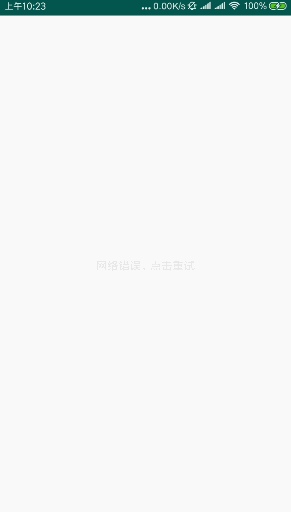

# ViewState 一个简单的视图状态控制库。


- 优点：

1. 轻量：简单易用
2. 省内存：使用 `ViewStub`，所有未使用到的状态均不会初始化，减少视图初始化开销。
3. 解耦、封装：降低各种视图状态和业务层耦合，使用者只需要关心业务层逻辑而无需知道视图状态管理内部逻辑。
4. 自由：不提供任何状态视图，高度可配置，完全由开发者自己定义。
5. 强大：可以使用在任何 `Activity`、`Fragment`、`View` 当中。


- 目前该库包含的状态有9种：


| 常量名称 | 含义 | 使用场景 |
| --- | --- | --- |
| LOADING | 加载中 | 页面加载中状态 |
| NETWORK_ERROR | 网络错误 | 当网络连接错误时展示的界面 |
| LOAD_ERROR | 加载失败 | 接口请求失败时展示给用户的界面 |
| EMPTY | 空布局 | 当获取的数据为空时展示的界面 |
| NOT_FOUND | 未找到内容布局 | 有时获取的内容已被服务器删除，此时展示给用户一个404内容被删除的界面 |
| CONTENT | 内容 | 真正需要展示给用户的内容视图，也是开发者在layout里实际布局的视图 |
| WIDGET_NETWORK_ERROR | 网络错误小部件 | 一个类似于QQ、微信断网时顶部显示的网络错误提示视图 |
| WIDGET_ELFIN | 小精灵(提示布局) | 一种顶部出现的提示布局，可以做类似于简书刷新时提醒推荐内容条数的小部件 |
| WIDGET_FLOAT | 底部Float | 一种底部弹出的浮动布局，可以实现底部弹出小组件的功能 |

在这里我们将前6种状态称之为普通状态视图，后面3种统称为 `Widget`小部件。

其中，普通状态视图不会同时显示，`Widget` 小部件状态的显示和前6种状态不冲突(可以同时显示)，

视图层次上 `Widget` 在普通状态视图之上，`WIDGET_ELFIN` 在 `WIDGET_NETWORK_ERROR` 之下。


### 添加 `ViewState` 到项目

- 第一步： 添加 `JitPack` 到项目的根 `build.gradle` 中


```gradle
allprojects {
    repositories {
        ...
        maven { url 'https://jitpack.io' }
    }
}
```

- 第二步：添加库依赖


```gradle
dependencies {
    implementation 'com.github.huangziye:ViewState:${latest_version}'
}
```


### 全局配置


ViewState 库不提供任何状态的视图，完全由开发者自己自定义提供。


- 获取全局视图控制管理者

```
ViewStateManager.getInstance()
```


- 配置状态视图

```
/**
 * @param viewState 视图状态
 * @param layoutResId 开发者自定义的该状态视图
 */
override fun addViewStateConfig(@ViewState viewState: Int, layoutResId: Int)


 /**
 *
 * @param viewState 视图状态
 * @param layoutResId 开发者自定义的该状态视图
 * @param retryTriggerViewId 该状态视图上点击事件的触发控件id
 * @param retryListener 点击事件触发后的回调
 */
override fun addViewStateConfig(
    @ViewState
    viewState: Int,
    layoutResId: Int,
    retryTriggerViewId: Int,
    retryListener: OnRetryListener
)


 /**
 * 该方法只针对Widget相关状态有效
 * @param viewState 视图状态
 * @param marginTopPx widget相对于内容视图的顶部距离,比如可能需要预留出顶部Toolbar高度的距离
 * @param marginBottomPx widget相对于内容视图的底部距离,比如可能需要预留出底部导航栏高度的距离
 */
override fun setWidgetMargin(
    @ViewState @IntRange(from = 7, to = 9) viewState: Int, marginTopPx: Int,
    marginBottomPx: Int
)

```


- 配置网络状态提供者

考虑到开发者项目中都有自己的网络状态监听、判断的工具类，所以UiStatus没有必要额外编辑这段功能代码，仅需要开发者配置一个回调即可。配置网络状态提供者后，在请求显示普通的状态时如果是没有网络那么将自动重定向到NETWORK_ERROR网络错误状态界面。

具体配置方法如下:

```
ViewStateNetworkStateProvider.getInstance()
    .registerOnRequestNetworkStateEvent(object : OnRequestNetworkStateEvent {
        override fun onRequestNetworkState(context: Context): Boolean {
            return NetworkManager.isConnected(context)
        }
    })
```


### 具体使用


ViewState 可以使用在任何 `Activity`、`View` 以及 `Fragment` 中。

- Activity

```
ViewStateController.getInstance().bind(this)
```

- Fragment

由于Fragment的特殊性，所以这里稍微麻烦一点点

```
override fun onCreateView(inflater: LayoutInflater, container: ViewGroup?, savedInstanceState: Bundle?): View? {
    val textView = TextView(context)
    textView.layoutParams = ViewGroup.LayoutParams(-1, -1)
    textView.text = "我是Fragment"
    textView.setTextColor(Color.BLACK)
    textView.textSize = 48f
    textView.gravity = Gravity.CENTER
    mViewStateController = ViewStateController.getInstance()
    return mViewStateController.bindFragment(textView)
}
```

看以看出这里是使用bindFragment(view)方法将原本的内容视图传递给UiStatus，并将该方法返回的控件作为onCreateView的返回值即可。


- View

```
ViewStateController.getInstance().bind(view)
```


- 视图状态切换


```
对于普通视图切换使用 ViewStateController.changeViewStateIgnore(viewState) 切换；

对于Widget视图使用 ViewStateController.showWidget(viewState) 进行显示；

或者使用其重载方法 showWidget(viewState,duration) 方法进行显示，使用该方法时会在 duration 时间后自动隐藏；

也可以使用 ViewStateController.hideWidget() 方法进行隐藏 Widget 小部件。
```


### 个性化配置

一般情况下使用在 `Application` 中的全局配置已经能满足大部分页面视图状态的需求，如果某些个别界面需要特殊配置那么 `ViewState` 也是支持的。
只需要使用持有的 `ViewStateController` 对象，调用其 `addViewStateConfig()` 或其他任何可以在全局配置中使用的方法重新配置即可。


### 优化

一般的开发者只需要在自定义的 `Application` 中全局配置一次即可，并且对于 `LOADING`、`LOAD_ERROR`、`EMPTY`、`NOT_FOUND`、`CONTENT` 这些普通视图的切换可以下沉到统一在基类 `Activity`、`Fragment` 或者网络加载框架中处理，具体使用大同小异，可参考 `Demo`，这里不再赘述。


### 效果预览



<br />

### 关于我


- [简书](https://user-gold-cdn.xitu.io/2018/7/26/164d5709442f7342)

- [掘金](https://juejin.im/user/5ad93382518825671547306b)

- [Github](https://github.com/huangziye)

<br />

### License

```
Copyright 2018, huangziye

   Licensed under the Apache License, Version 2.0 (the "License");
   you may not use this file except in compliance with the License.
   You may obtain a copy of the License at

       http://www.apache.org/licenses/LICENSE-2.0

   Unless required by applicable law or agreed to in writing, software
   distributed under the License is distributed on an "AS IS" BASIS,
   WITHOUT WARRANTIES OR CONDITIONS OF ANY KIND, either express or implied.
   See the License for the specific language governing permissions and
   limitations under the License.
```


